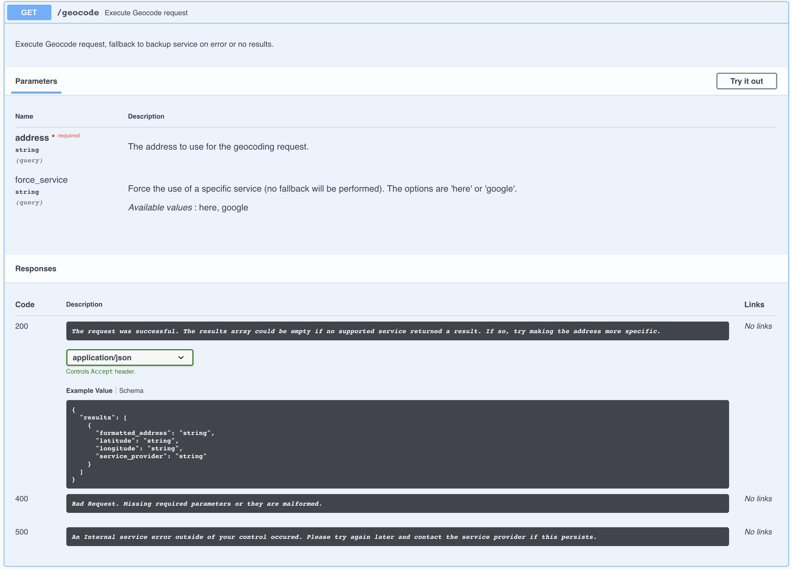
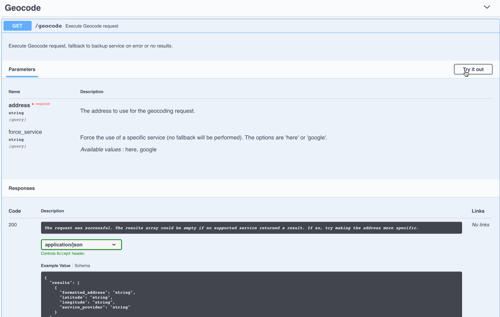

# Geocoding Proxy Service - Coding Challenge

This project was completed over a couple of evenings as part of a coding challenge. The challenge requirement was to implement a RESTful Geocoding proxy service which supports multiple downstream service providers. The service should fallback to a backup service if the primary provider is down or returns no results.

## Running the Service

### Python version and dependencies

The service was implemented and tested with `Python version 3.7.3`. There are several other dependencies which can be seen in [requirements.txt](requirements.txt)

### Installing the required dependencies

#### Python3

On MacOS, It is recommended to use [pyenv](https://github.com/pyenv/pyenv) to install `python3`. `pyenv` can be installed via [homebrew](https://brew.sh/)

You can find the full instructions to install and configure `pyenv` [here.](https://github.com/pyenv/pyenv#installation)

#### Python dependencies

Using [Python venv](https://packaging.python.org/guides/installing-using-pip-and-virtual-environments/) is recommended. Luckily, `venv` comes as part of a standard `python3` installation. Installing the requirements in a new virutal environment can be done as so:

```bash
$ cd <geocoding_project_root_dir>
$ python -m venv venv
$ source venv/bin/activate
$ pip install -r requirements.txt
```

#### Update the Geoservice Credentials File

**This step is super important** :exclamation:
To run the service you need valid credentials for the [Google geocoding service](https://developers.google.com/maps/documentation/geocoding/start) and the [HERE geocoding service](https://developer.here.com/documentation/geocoder/topics/what-is.html). When you've obtained credentials for both services, copy the [geoservice_credentials.json.example](geoservice_credentials.json.example) file to `geoservice_credentials.json` and add your credentials there:

```bash
$ cp geoservice_credentials.json.example geoservice_credentials.json
$ # Add your credentials to geoservice_credentials.json
```

#### Run the Geocoding Service

With the previous steps complete, running the service should be as simple as:

```bash
$ python server.py

 * Serving Flask app "server" (lazy loading)
 * Environment: production
   WARNING: This is a development server. Do not use it in a production deployment.
   Use a production WSGI server instead.
 * Debug mode: on
 * Running on http://0.0.0.0:5000/ (Press CTRL+C to quit)
 * Restarting with stat
 * Debugger is active!
 * Debugger PIN: 158-387-064
```

##### Running via Docker

A [Dockerfile](Dockerfile) is provided to make running via `Docker` a breeze. To build the image, do the following:
:warning: **Make sure you update the [geoservice_credentials.json](#Update-the-Geoservice-Credentials-File) file before building the docker image**

```bash
$ cd <geocoding_project_root_dir>
$ docker build -t geocoding-proxy .
```

With the image built, running the the server is as simple as:

```bash
$ docker run -it --rm -p 5000:5000 --name geocoding-proxy-instance geocoding-proxy
```

*Tested with Docker Engine version 18.09.2, build 6247962*

#### Run the Geocoding Service Functional Tests

The functional tests can be run as follows:

```bash
$ python test_geocoding_proxy_functional.py
.........
----------------------------------------------------------------------
Ran 9 tests in 2.057s

OK
```

##### Generate Code Coverage Report

A code coverage report for the tests can be obtained also:

```bash
$ coverage run test_geocoding_proxy_functional.py
.........
----------------------------------------------------------------------
Ran 9 tests in 1.713s

OK

$ coverage report
Name                                                                               Stmts   Miss  Cover
------------------------------------------------------------------------------------------------------
geocode_controller.py                                                                 23      1    96%
geocoding_services/__init__.py                                                         0      0   100%
geocoding_services/geocoding_service.py                                               21      6    71%
geocoding_services/geocoding_service_builder.py                                       18      3    83%
geocoding_services/google_geocoding_service.py                                        25      5    80%
geocoding_services/here_geocoding_service.py                                          23      3    87%
server.py                                                                             11      2    82%
```

#### How to use the Geocoding Proxy REST Service

The REST Service definition is specified according to the [OpenAPI 3.0 standard](https://swagger.io/specification/) and can be found viewed in the [openapi.yml](openapi.yaml) file.

By default, the service hosts an interactive UI for viewing its RESTful interface. With the service running, navigating to [http://0.0.0.0:5000](http://0.0.0.0:5000) will launch the [SwaggerUI](https://swagger.io/tools/swagger-ui/) viewer.

##### REST Service API Definition

An image of the REST Service definition is provided below for convenience:



##### Testing the Service from the SwaggerUI interface

The **Try it out** button on the SwaggerUI interface provides a convenient way to try out the REST Service API:



##### Testing the Service via cURL

Of course, the venerable `cURL` is a tried and true companion:

```bash
$ curl "http://0.0.0.0:5000/v1/geocode?address=carmen+sandiego"
{
  "results": [
    {
      "formatted_address": "Calle El Carmen, San Diego, Rep\u00fablica Bolivariana De Venezuela",
      "latitude": 10.21208,
      "longitude": -67.96923,
      "service_provider": "Here"
    }
  ]
}
```

##### Testing the Service via Postman

Another handy tool worth an honorable mention is [Postman](https://www.getpostman.com/downloads/).

## Licence

This project is published under the [MIT Licence](LICENSE)
